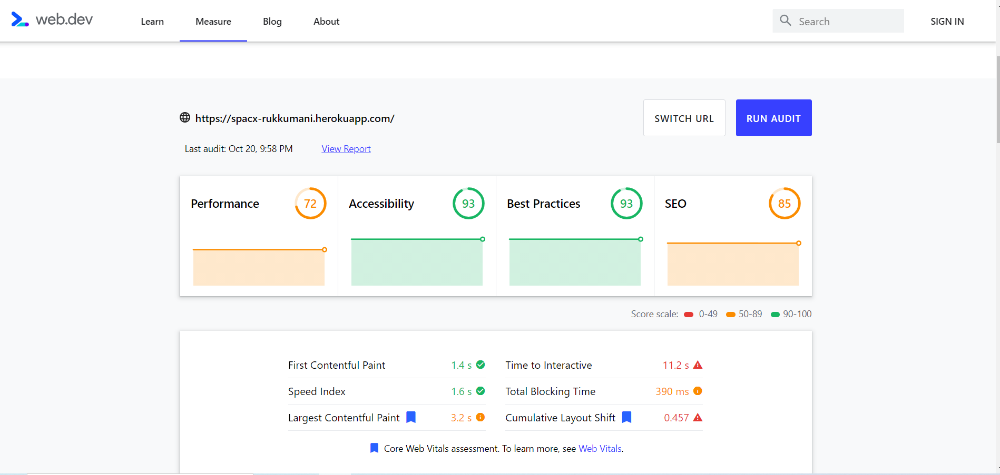

1)This project is developed by server side rendering mechanism. so client can get the page very quickly eventhough. the client has very poor internert.
2)This project is using angular universal to render the page from serverside.__
3)using angular cli develop angular app
4)Then install ng add @nguniversal/express-engine. it will create boiler plate code,then creates node serve also 
5)ng build:ssr it will build the angular app 
6)ng serve:ssr will serve the app from node server so front end no need to do anything .
7)this project is developed using only css not any frame work .we used the flex
8)performance is analized by lighthouse

